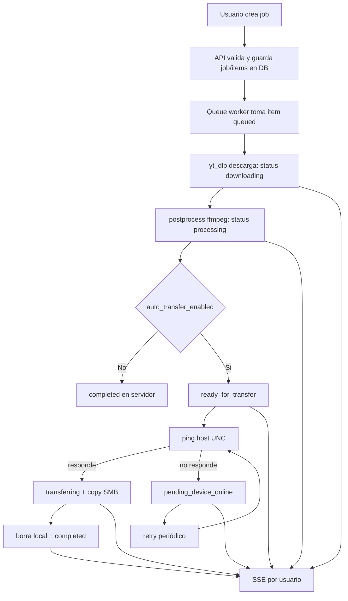
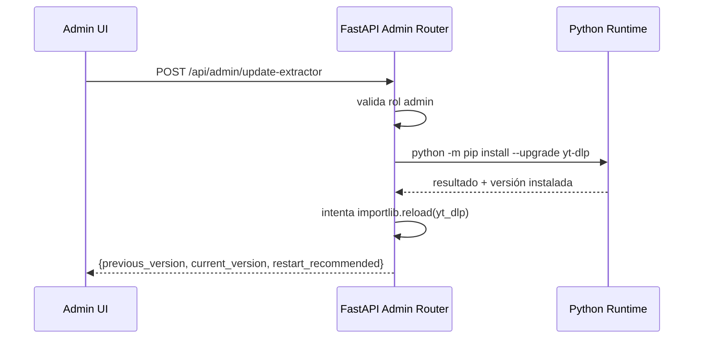

# Arquitectura V1.1 - DownloaderYT

## 1. Objetivo y alcance
V1.1 implementa un descargador personal/familiar multiusuario, seguro y autohospedado, con:

- Backend `FastAPI` + `SQLite` (WAL) + `SQLAlchemy` + `Alembic`.
- Frontend `React + Vite`.
- Descarga nativa con `yt_dlp` (sin `yt-dlp.exe`).
- Cola de procesamiento secuencial (`concurrency=1` por defecto).
- Aislamiento estricto por usuario en API, base de datos, SSE y filesystem.
- Auto-transferencia opcional por red local/Tailscale usando ruta UNC SMB.

Fuera de alcance V1.1:

- Google Drive.
- Transferencias multiprotocolo avanzadas (SFTP/NFS/etc.).
- Exposición pública a internet (se opera por Tailscale + MagicDNS).

## 2. Arquitectura backend

### 2.1 Capas

```text
backend/
├── app/
│   ├── main.py
│   ├── api/
│   │   ├── dependencies.py
│   │   └── routers/
│   │       ├── auth.py
│   │       ├── jobs.py
│   │       ├── items.py
│   │       ├── events.py
│   │       └── admin.py
│   ├── core/
│   │   ├── config.py
│   │   ├── security.py
│   │   └── rate_limit.py
│   ├── db/
│   │   ├── database.py
│   │   ├── models.py
│   │   └── session_store.py
│   ├── schemas/
│   │   ├── user.py
│   │   ├── auth.py
│   │   ├── job.py
│   │   └── item.py
│   └── services/
│       ├── downloader.py
│       ├── queue_worker.py
│       └── event_bus.py
├── alembic/
├── data/
├── downloads/
├── requirements.txt
└── .env
```

### 2.2 Responsabilidades

- `main.py`: bootstrap de FastAPI, registro de routers, CORS, startup/shutdown.
- `database.py`: engine/session y PRAGMAs SQLite:
  - `journal_mode=WAL`
  - `synchronous=NORMAL`
  - `busy_timeout=5000`
  - `foreign_keys=ON`
- `security.py`: hash de contraseñas, creación/validación/revocación de sesión.
- `session_store.py`: persistencia de sesiones en DB.
- `downloader.py`: wrapper `yt_dlp.YoutubeDL`, `progress_hooks`, `postprocessor_hooks`.
- `queue_worker.py`: ciclo secuencial de jobs/items y lógica de transferencia SMB.
- `event_bus.py`: publicación de eventos de progreso por usuario para SSE.

### 2.3 Flujo general backend



## 3. Arquitectura frontend

### 3.1 Estructura objetivo

```text
frontend/
├── index.html
├── vite.config.js
├── package.json
├── src/
│   ├── main.jsx
│   ├── app/
│   │   ├── App.jsx
│   │   ├── router.jsx
│   │   └── providers.jsx
│   ├── assets/
│   ├── components/
│   │   ├── layout/
│   │   ├── jobs/
│   │   └── ui/
│   ├── features/
│   │   ├── auth/
│   │   ├── jobs/
│   │   └── admin/
│   ├── pages/
│   │   ├── Login.jsx
│   │   ├── Dashboard.jsx
│   │   └── CreateJob.jsx
│   ├── services/
│   │   ├── api.js
│   │   ├── sse.js
│   │   └── queryClient.js
│   ├── store/
│   │   ├── authStore.js
│   │   └── uiStore.js
│   └── utils/
└── .env
```

### 3.2 Principios de estado

- `TanStack Query`: server-state (jobs, items, me, admin status).
- `Zustand`: estado local de sesión/UI (usuario actual, flags de interfaz, reconexión SSE).
- SSE:
  - canal único autenticado por cookie
  - merge incremental de eventos en cache de Query
  - fallback a refetch al reconectar

## 4. Modelo de datos y estados

### 4.1 Tablas

- `users`
  - `id`, `username` (unique), `password_hash`, `role` (`admin|user`), `created_at`
- `sessions`
  - `id`, `user_id`, `token_hash`, `expires_at`, `revoked_at`, `created_at`, `last_seen_at`
- `jobs`
  - `id`, `user_id`, `status`, `config_json`, `created_at`, `updated_at`
- `job_items`
  - `id`, `job_id`, `source_url`, `status`, `progress_pct`, `downloaded_bytes`, `total_bytes`,
    `speed`, `eta`, `output_path`, `error_message`, `next_retry_at`, `created_at`, `updated_at`
- `settings`
  - `id`, `user_id` (unique), `download_root_override`, `concurrency`,
    `auto_transfer_enabled` (bool, default `false`),
    `transfer_target_path` (UNC), `created_at`, `updated_at`

### 4.2 Estados `job_items`

- `pending`
- `queued`
- `downloading`
- `processing`
- `ready_for_transfer`
- `transferring`
- `pending_device_online`
- `completed`
- `failed`
- `canceled`

### 4.3 Reglas de ownership

- Todo registro de job/item/settings pertenece a un `user_id`.
- El backend siempre filtra por usuario autenticado.
- Si recurso no pertenece al usuario: respuesta `404`.

## 5. Auto-transferencia SMB

### 5.1 Reglas funcionales

1. Si `auto_transfer_enabled = false`: al terminar procesamiento, `completed`.
2. Si `auto_transfer_enabled = true`:
   - valida `transfer_target_path` como UNC (`\\host\share\...`).
   - extrae `host` y ejecuta ping (`ping -n 1 -w 1000 host`).
   - si host responde:
     - estado `transferring`
     - copia con `shutil.copy2` al destino UNC
     - si éxito, elimina archivo local y marca `completed`
   - si host no responde:
     - marca `pending_device_online`
     - reintenta en ciclo posterior (backoff fijo configurable; default 60s)

### 5.2 Sanitización y seguridad de archivos

- El archivo temporal/final del servidor siempre se guarda bajo `downloads/{username}/`.
- Se bloquean rutas absolutas externas y traversal (`..`).
- `output_path` en DB es ruta controlada y verificable antes de servir descarga HTTP.

## 6. Contrato API

### 6.1 Auth

- `POST /api/auth/login`
- `POST /api/auth/logout`
- `GET /api/auth/me`

### 6.2 Jobs e items

- `POST /api/jobs`
- `GET /api/jobs`
- `GET /api/jobs/{id}`
- `POST /api/jobs/{id}/cancel`
- `POST /api/items/{id}/retry`
- `GET /api/items/{id}/download`

### 6.3 Eventos y admin

- `GET /api/events` (SSE por usuario autenticado)
- `POST /api/admin/update-extractor` (solo `admin`)

### 6.4 Convenciones de error

- `401`: no autenticado.
- `403`: autenticado sin permisos (ej. endpoint admin).
- `404`: recurso no existe o no pertenece al usuario.
- `422`: validación de payload.
- `500`: error interno no controlado.

## 7. Operación y configuración

### 7.1 Red y CORS

- Operación por Tailscale/MagicDNS.
- CORS con lista explícita de origins:
  - `http://localhost:<puerto>`
  - `http://127.0.0.1:<puerto>`
  - `http://<host-magicdns>:<puerto>`
- `allow_credentials=true` por auth vía cookie.

### 7.2 Variables de entorno (`.env`)

- `APP_ENV=dev|prod`
- `APP_HOST`, `APP_PORT`
- `APP_SECRET_KEY`
- `APP_COOKIE_SECURE`
- `APP_CORS_ORIGINS` (CSV)
- `APP_DB_PATH=./data/app.db`
- `APP_DOWNLOADS_ROOT=./downloads`
- `APP_WORKER_CONCURRENCY=1`
- `APP_TRANSFER_RETRY_SECONDS=60`

### 7.3 Mantenimiento

- Endpoint admin para actualizar extractor:
  - ejecuta `python -m pip install --upgrade yt-dlp`
  - reporta versión previa/nueva
  - si reload parcial, retorna `restart_recommended=true`
- Backup recomendado:
  - snapshot periódico de `data/app.db`
  - respaldo de `downloads/`

## 8. Diagrama de admin update extractor


