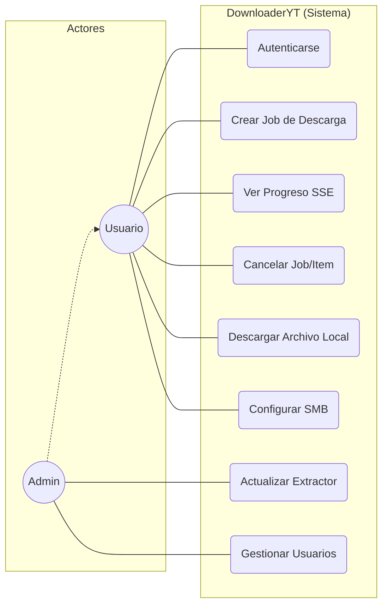
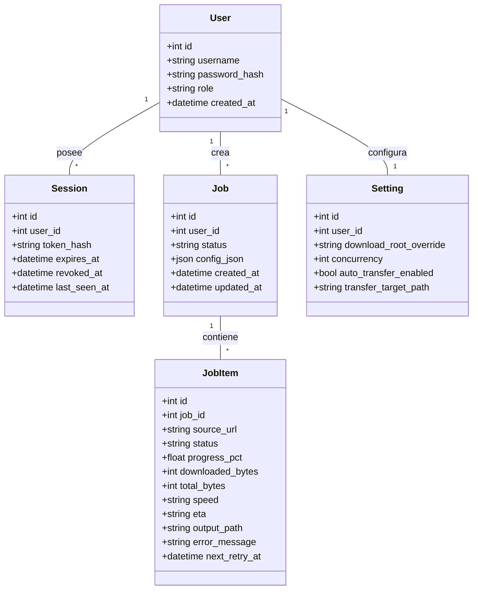
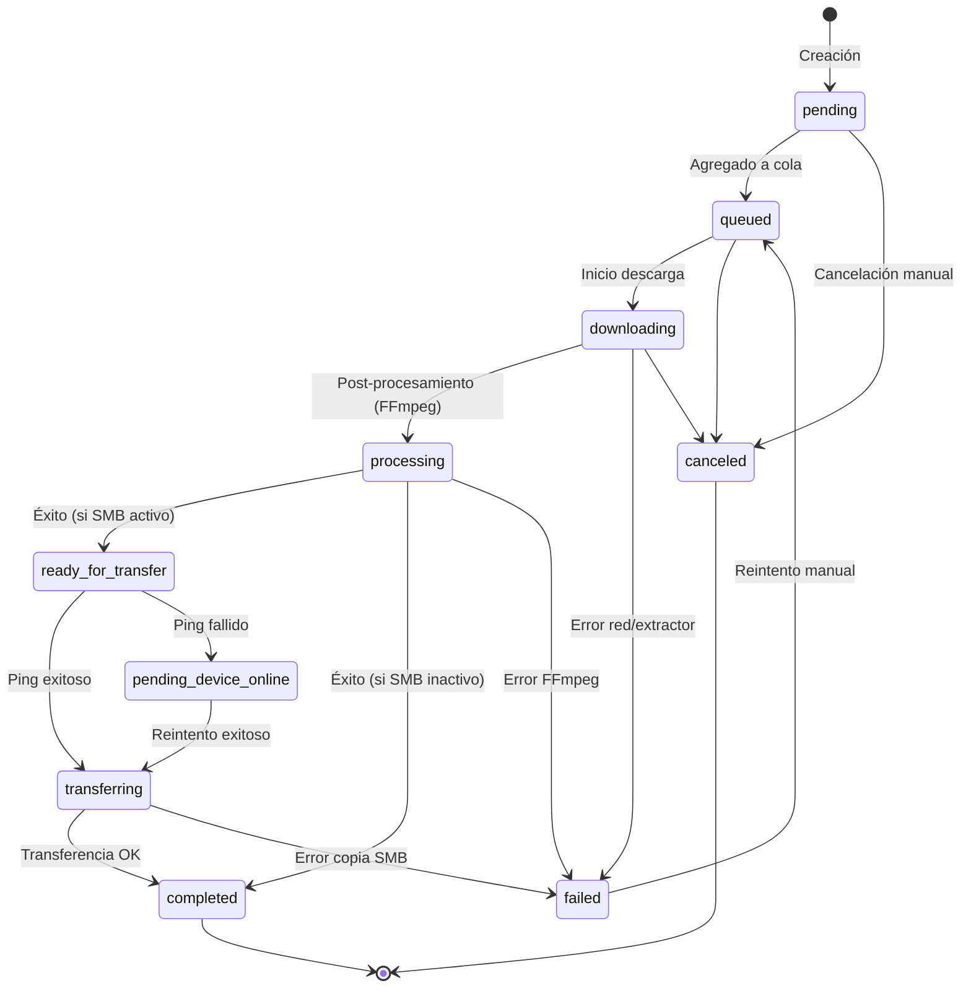
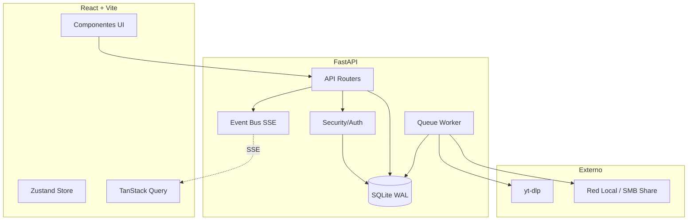

# Documentación Técnica y UML - DownloaderYT V1.1

Este documento sirve como referencia central para entender la arquitectura, el flujo de datos y los conceptos operativos del sistema. Está diseñado para ser interpretado tanto por desarrolladores humanos como por agentes de IA.

## 0. Glosario de Conceptos Clave

Para entender este sistema, es fundamental distinguir los siguientes términos:

| Término | Definición | Contexto en el Proyecto |
| :--- | :--- | :--- |
| **Job (Tarea)** | Un contenedor lógico que agrupa una o varias solicitudes de descarga. | Cuando pegas una lista de URLs, se crea un *Job* que las contiene todas. |
| **JobItem (Ítem)** | La unidad mínima de trabajo. Corresponde a un único archivo/video a descargar. | Cada video de una playlist es un *JobItem*. Tiene su propio progreso y estado. |
| **SSE (Server-Sent Events)** | Tecnología que permite al servidor enviar actualizaciones en tiempo real al navegador. | Se usa para que veas el % de descarga y la velocidad sin que el navegador tenga que preguntar constantemente. |
| **SMB / UNC** | Protocolo de red para compartir archivos en Windows/Linux. | Permite que el servidor mueva automáticamente el archivo descargado a tu PC personal o NAS usando rutas como `\\MiPC\Descargas`. |
| **yt-dlp** | Herramienta de línea de comandos potente para descargar videos. | Es el "motor" interno. El proyecto lo usa de forma nativa para obtener la mejor calidad y compatibilidad. |
| **SQLite WAL** | *Write-Ahead Logging*. Un modo de alta eficiencia para la base de datos. | Permite que el servidor escriba información y el usuario lea el progreso simultáneamente sin bloqueos ni lentitud. |
| **Worker (Trabajador)** | Proceso de fondo independiente de la interfaz web. | Es el encargado de hacer el "trabajo sucio": descargar, convertir con FFmpeg y mover archivos por la red. |

---

## 1. Diagrama de Casos de Uso
Define las interacciones de los actores con el sistema.

## 2. Diagrama de Clases (Modelo de Datos)
Representa las entidades y sus relaciones en la base de datos SQLite.

## 3. Diagrama de Estados (Ciclo de Vida de JobItem)
Muestra las transiciones de estado para un item individual.

## 4. Diagrama de Componentes (Arquitectura del Sistema)
Visión lógica de cómo interactúan las capas del sistema.

